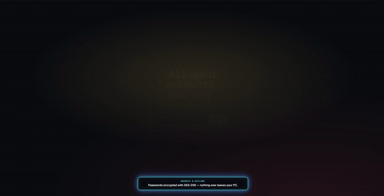

# Marvel Account Keeper

A small, local desktop app for tracking your Marvel Rivals / Steam accounts —
in-game name, username, email, password, and current / peak rank. It runs
entirely on your machine; nothing is sent anywhere.




## Get started (Windows — this is almost everyone)

There's nothing to "install" — Marvel Account Keeper is a single file you run.

1. **Download the app.** Open the
   [**Releases page**](https://github.com/itsnotyuiiii/marvel-account-keeper/releases),
   find the newest release at the top, and under **Assets** download
   **`MarvelAccountKeeper-windows.exe`**. That's the file 99% of people want.
2. **Put it somewhere handy** — your Desktop, or a folder like
   `Documents\Marvel Account Keeper`. It runs fine from anywhere.
3. **Double-click it.** Your web browser opens the app on its own. A small
   black window also appears — that's normal, just leave it be.
4. **When you're done, close the browser tab.** The app shuts itself down a
   couple of minutes later — nothing is left running in the background.

No Python, no installer, no internet connection — everything runs on your own
PC, and it works completely offline.

> [!NOTE]
> The first time you run it, Windows may show a blue **"Windows protected your
> PC"** box, because the app isn't code-signed. Click **More info → Run
> anyway**. It's safe — the source code is public and the app never connects
> to the internet.

## Mac & Linux

Download `MarvelAccountKeeper-macos` or `MarvelAccountKeeper-linux` from the
[Releases page](https://github.com/itsnotyuiiii/marvel-account-keeper/releases)
instead. Make it runnable once in a terminal —
`chmod +x MarvelAccountKeeper-macos` — then double-click or run it. On macOS
you may also need *System Settings → Privacy & Security → Open Anyway*.

## First launch — set your password

The first time it opens, the app asks you to **create a master password**. It
locks the account passwords you save (strong encryption — scrypt key
derivation + AES-256-GCM) and is **never written down anywhere**.

Pick something you'll remember: if you forget it, the saved passwords can't be
recovered. Everything else (in-game name, email, ranks, notes) is stored
normally and stays readable.

## Where your data lives

Your vault is a single `vault.json` file in a per-user data folder:

| OS | Location |
|----|----------|
| Windows | `%APPDATA%\MarvelAccountKeeper\vault.json` |
| macOS   | `~/Library/Application Support/MarvelAccountKeeper/vault.json` |
| Linux   | `~/.local/share/MarvelAccountKeeper/vault.json` |

Timestamped backups are written next to it under `backups/` (and a second
copy under your `Documents/MarvelAccountsBackups/`) on every save. If you ran
an older script-style version, your existing `vault.json` is imported
automatically the first time the new app starts.

## Security notes

- The app binds to `127.0.0.1` (loopback) only — it is not reachable from your
  network.
- The decryption key is held in memory only. The vault auto-locks after a
  configurable idle period (default 30 min — change it under **Options**), on
  quit, or when you click **Lock**.

---

## For developers

**Everything below is optional — you do not need any of this to use the app.**
It only covers running from source or building the executable yourself.

### Running from source

You don't need the executable — with Python 3.10+ installed:

```sh
pip install -r requirements.txt
python app.py
```

It picks a free port and opens your browser, same as the packaged app. On
Windows you can also just double-click `run.bat`.

### Building it yourself

See [BUILDING.md](BUILDING.md) for producing the executables locally, and
[`.github/workflows/release.yml`](.github/workflows/release.yml) for the CI
that builds all three OS binaries on every `v*` tag.

---

Created by Yui · [github.com/itsnotyuiiii](https://github.com/itsnotyuiiii)
